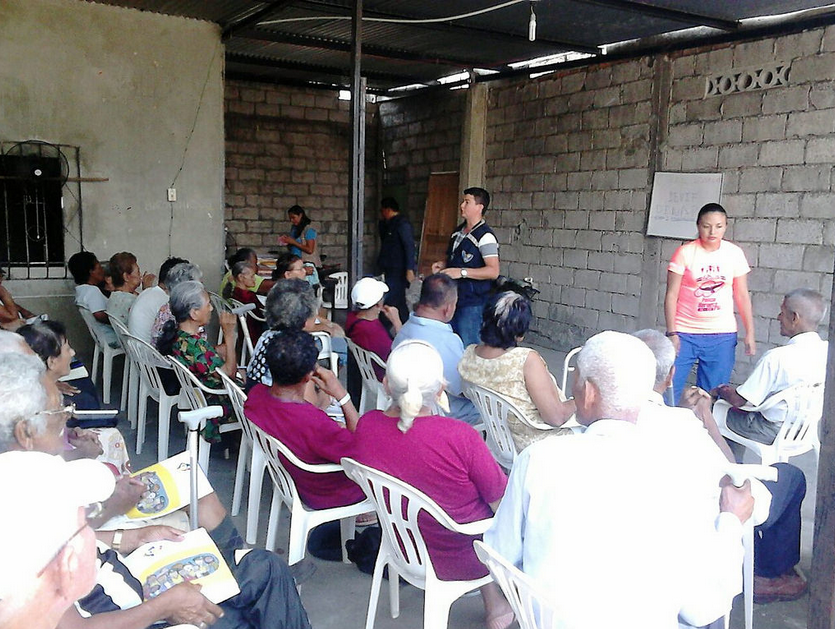
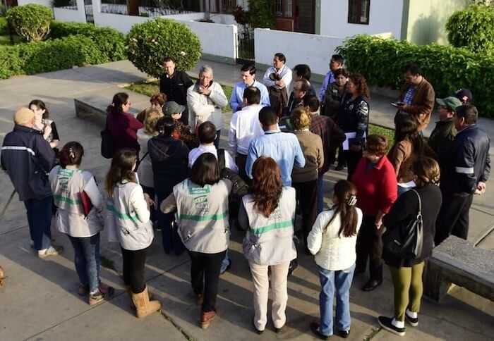

## Introducción

### Objetivo del videotutorial

En este videotutorial, exploraremos qué es la participación ciudadana y por qué es crucial en el proceso de dinamización comunitaria, especialmente en cómo puede fortalecer las comunidades y mejorar la calidad de vida de sus miembros.

### Breve agenda

Cubriremos la definición de participación ciudadana, sus beneficios, métodos y desafíos, y concluiremos con un llamado a la acción para que todos podamos contribuir a nuestras comunidades.

### Enganche inicial

¿Sabías que comunidades con altos niveles de participación ciudadana reportan mejores servicios públicos y una mayor satisfacción entre sus residentes?

Veamos cómo podemos lograr estos beneficios en nuestra comunidad.

## Desarrollo

## Definición de Participación Ciudadana

### Explicación del concepto

La participación ciudadana se refiere a la involucración de los ciudadanos en la toma de decisiones políticas, desde el nivel local hasta el internacional, afectando directamente las políticas que moldean nuestras vidas.

### Elementos clave

Incluye aspectos como la votación, asistir a reuniones, participar en foros públicos y colaborar en proyectos comunitarios.

La forma en que las decisiones pasan de la comunidad al gobierno y viceversa varía según el país y el sistema político. Sin embargo, existen algunos elementos comunes que se pueden observar en la mayoría de los casos.

#### Ejemplos locales:

##### Reuniones comunitarias

Las reuniones comunitarias son una forma común en que los residentes pueden expresar sus opiniones y preocupaciones a los funcionarios del gobierno local. Los funcionarios pueden utilizar esta información para tomar decisiones que afecten a la comunidad.

> Fuente: www.ministeriodegobierno.gob.ec

##### Juntas vecinales

Las juntas vecinales son grupos de residentes que se reúnen para discutir problemas locales y trabajar juntos para encontrar soluciones. Las juntas vecinales pueden luego llevar sus preocupaciones a los funcionarios del gobierno local.

> Fuente: afadministradores.com

##### Peticiones

Las peticiones son una forma en que las personas pueden mostrar su apoyo a una causa o problema en particular. Las peticiones con un gran número de firmas pueden llamar la atención de los funcionarios del gobierno y llevar a la acción.
Imagen de PeticionesSe abre en una ventana nueva
es.slideshare.net

#### Ejemplos nacionales:

Elecciones: Las elecciones son una forma en que las personas pueden elegir a los representantes que tomarán decisiones en su nombre. Los votantes pueden elegir candidatos que compartan sus valores y prioridades.
Imagen de EleccionesSe abre en una ventana nueva
www.celag.org
Grupos de presión: Los grupos de presión son organizaciones que intentan influir en las políticas gubernamentales. Los grupos de presión pueden hacer esto reuniéndose con funcionarios del gobierno, testificando en audiencias públicas y donando a campañas políticas.
Imagen de Grupos de presiónSe abre en una ventana nueva
www.politocracia.com
Protestas: Las protestas son una forma en que las personas pueden expresar su disconformidad con las políticas gubernamentales. Las protestas pueden ser pacíficas o violentas.
Imagen de ProtestasSe abre en una ventana nueva
monitor.civicus.org
Ejemplos internacionales:

Organizaciones internacionales: Las organizaciones internacionales, como las Naciones Unidas, brindan un foro para que los países discutan problemas globales y tomen decisiones conjuntas.
Imagen de Organizaciones internacionalesSe abre en una ventana nueva
www.bmeia.gv.at
Tratados: Los tratados son acuerdos entre países que establecen reglas para la cooperación en áreas como el comercio, la defensa y el medio ambiente.
Imagen de TratadosSe abre en una ventana nueva
www.uo.edu.mx
Derecho internacional: El derecho internacional es un conjunto de normas y principios que regulan las relaciones entre países. El derecho internacional puede ser aplicado por tribunales internacionales.
Imagen de Derecho internacionalSe abre en una ventana nueva
concepto.de
Es importante tener en cuenta que estos son solo algunos ejemplos de cómo las decisiones pasan de la comunidad al gobierno y viceversa. La forma específica en que esto sucede variará según las circunstancias particulares.

Conclusión
La relación entre la comunidad y el gobierno es compleja y constantemente está evolucionando. Hay muchas formas diferentes en que las decisiones pasan de la comunidad al gobierno y viceversa. Es importante comprender estas diferentes formas para participar en el proceso político y hacer oír su voz.

## Beneficios de la Participación Ciudadana

### Enumeración y descripción

Los beneficios incluyen mayor transparencia en la gestión, mejores servicios públicos, y una comunidad más unida y resiliente.

### Citas y casos de estudio

Por ejemplo, en la ciudad de X, la participación ciudadana en la planificación urbana resultó en espacios públicos más seguros y accesibles. Expertos como Jane Doe, especialista en políticas públicas, argumentan que...

## Métodos de Participación

### Descripción de métodos

Los métodos varían desde votaciones y encuestas online hasta foros comunitarios y grupos de acción local.

### Imágenes y vídeos

Mostrar clips de estos métodos en acción, como un foro comunitario o gente votando en una elección local.
Desafíos Comunes

### Discusión sobre desafíos

A pesar de sus beneficios, la participación ciudadana enfrenta desafíos como la baja participación, la desinformación y la resistencia al cambio.

### Soluciones y ejemplos

Veremos cómo comunidades como la de Y han superado estos desafíos mediante educación cívica y plataformas digitales para facilitar la participación.
Conclusiones

### Resumen de puntos clave

Hemos visto qué es la participación ciudadana, por qué es importante, cómo podemos participar y los desafíos que podríamos enfrentar.

### Llamado a la acción

Te animo a involucrarte en tu comunidad de la manera que puedas. Cada pequeña acción cuenta y juntos podemos hacer una gran diferencia.

### Agradecimientos

Gracias a todos los que contribuyeron a este tutorial, especialmente a los expertos y a los miembros de la comunidad que compartieron sus historias.